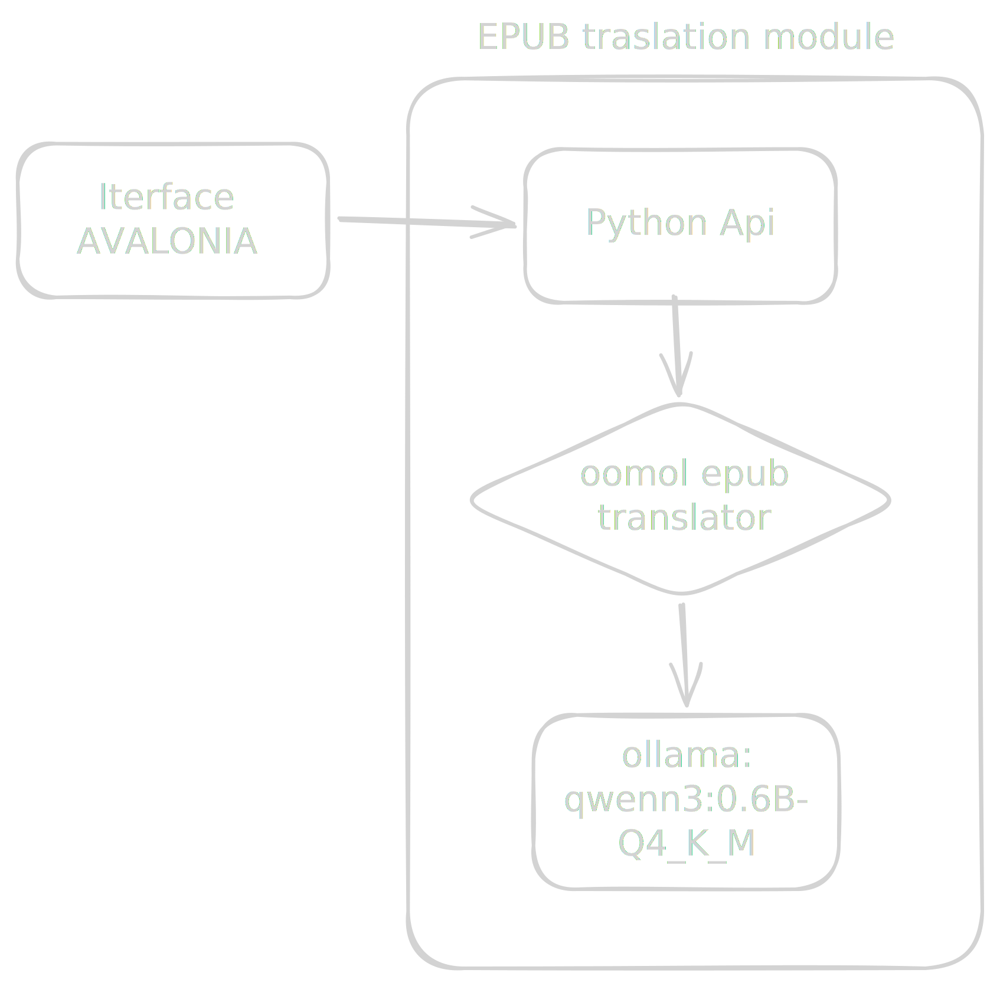

<div align="center">
  <h1>Lexicast</h1>
  <p><strong>Self-hosted EPUB translation, powered by a local LLM</strong></p>
  <p>
    A tiny FastAPI wrapper around <a href="https://github.com/oomol-lab/epub-translator">epub-translator</a><br/>
    plus a cross-platform Avalonia desktop client, fully dockerized alongside Ollama running Qwen3 locally.
  </p>
</div>

---

## System Requirements

- Docker and Docker Compose
- (Desktop client) [.NET 10 SDK](https://dotnet.microsoft.com/download/dotnet/10.0) — runs on Windows, Linux and macOS via Avalonia
- A GPU is recommended for Ollama (the bundled compose targets AMD/ROCm)

## Getting Started

```bash
cp python-api/.env.example python-api/.env   # optional, only for local (non-compose) runs
docker compose up -d
```

| Service | URL |
|---------|-----|
| API | http://localhost:8000 |
| Ollama | http://localhost:11434 |

The `ollama` service is pulled with the `rocm` image tag and mounts `/dev/kfd` and `/dev/dri`, targeting AMD GPUs (`HSA_OVERRIDE_GFX_VERSION=10.3.0`). Adjust the image/devices in `docker-compose.yml` if you're on NVIDIA/CPU.

On first run, pull the model into the `ollama` container:

```bash
docker compose exec ollama ollama pull qwen3
```

### Running the API locally (development)

```bash
# Start Ollama only
docker compose up ollama -d

cd python-api
pip install -r requirements.txt
export OLLAMA_BASE_URL=http://localhost:11434/v1
uvicorn app.main:app --reload
```

### Running the desktop client

```bash
cd LexicastUi
dotnet run
```

Point the app at the API URL (default `http://localhost:8000`) on the upload screen.

## Building

```bash
docker build -f python-api/dockerfile -t lexicast-api .
```

```bash
dotnet build LexicastUi/LexicastUi.csproj
```

## Architecture

<div align="center" style="margin-bottom:50px">
  <br/>
  
  <br/>
</div>

| Component | Type | Responsibility |
|-----------|------|----------------|
| `python-api` | FastAPI service | Accepts EPUB uploads, runs `epub-translator` jobs against Ollama, exposes progress + download |
| `LexicastUi` | Avalonia desktop app (.NET 10) | Pick an `.epub`, configure target language/prompt, track progress, download the translated file — runs on Windows, Linux and macOS |
| `ollama` | Ollama container | Serves the local LLM (Qwen3 by default) via an OpenAI-compatible endpoint |

Translation jobs run in-process on a thread pool (`JOB_WORKERS`) inside the API container — there's no external queue. Job state (status, progress, last warning) is kept in memory and polled/streamed by the client.

## API

### Translations

| Method | Route | Description |
|--------|-------|--------------|
| `POST` | `/translations` | Upload an `.epub` and start a translation job |
| `GET` | `/translations/{job_id}` | Get job status, progress and last warning |
| `GET` | `/translations/{job_id}/events` | Server-Sent Events stream of job status until `completed`/`failed` |
| `GET` | `/translations/{job_id}/download` | Download the translated `.epub` once the job is `completed` |

`POST /translations` accepts a multipart form:

| Field | Required | Description |
|-------|----------|-------------|
| `file` | yes | `.epub` file to translate |
| `target_language` | yes | Target language (e.g. `pt-BR`, `en`) |
| `concurrency` | no | Parallel translation requests to the LLM (default `1`) |
| `user_prompt` | no | Extra instructions appended to the translation prompt |
| `submit_kind` | no | `REPLACE`, `APPEND_TEXT` or `APPEND_BLOCK` (default `APPEND_BLOCK`) — how the translation is merged into the original text |

## Configuration

`python-api/.env.example`:

```env
OLLAMA_BASE_URL=http://localhost:11434/v1
OLLAMA_MODEL=qwen3
OLLAMA_API_KEY=ollama
TOKEN_ENCODING=cl100k_base
STORAGE_DIR=./data
JOB_WORKERS=4
```

| Variable | Description |
|----------|--------------|
| `OLLAMA_BASE_URL` | OpenAI-compatible Ollama endpoint (must end in `/v1`) |
| `OLLAMA_MODEL` | Model served by Ollama (default `qwen3`) |
| `OLLAMA_API_KEY` | Dummy key required by the LLM client lib; Ollama ignores it |
| `TOKEN_ENCODING` | `tiktoken` encoding used to estimate tokens when batching segments |
| `STORAGE_DIR` | Where uploaded/translated EPUBs are stored |
| `JOB_WORKERS` | Max number of translation jobs running in parallel |

## Tech Stack

| Layer | Technology |
|-------|------------|
| API | FastAPI + Uvicorn |
| Translation engine | [epub-translator](https://github.com/oomol-lab/epub-translator) |
| LLM runtime | Ollama (Qwen3 by default, ROCm image) |
| Desktop client | Avalonia UI (.NET 10, cross-platform) |
| Packaging | Docker / Docker Compose |
